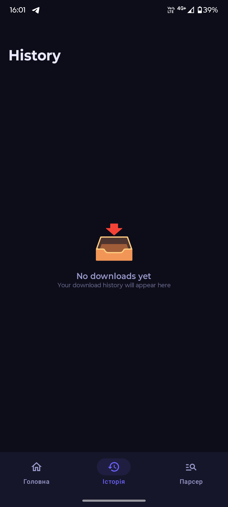
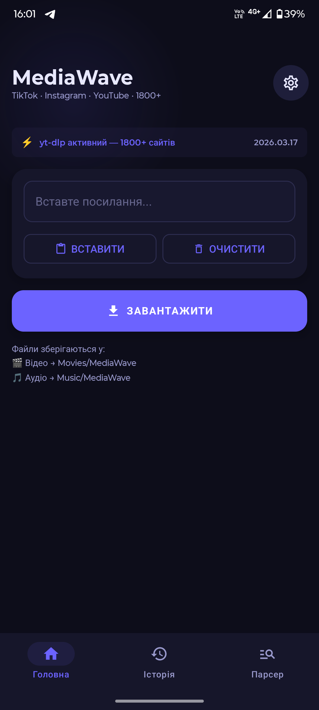
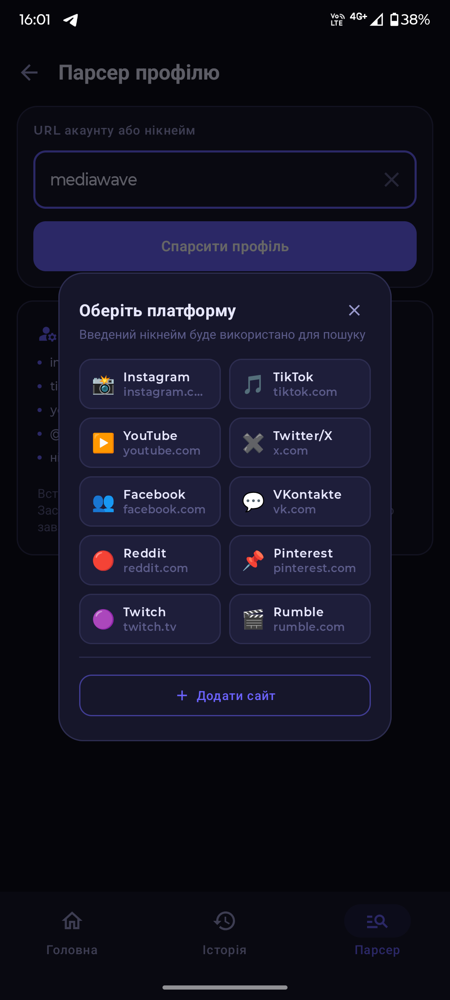
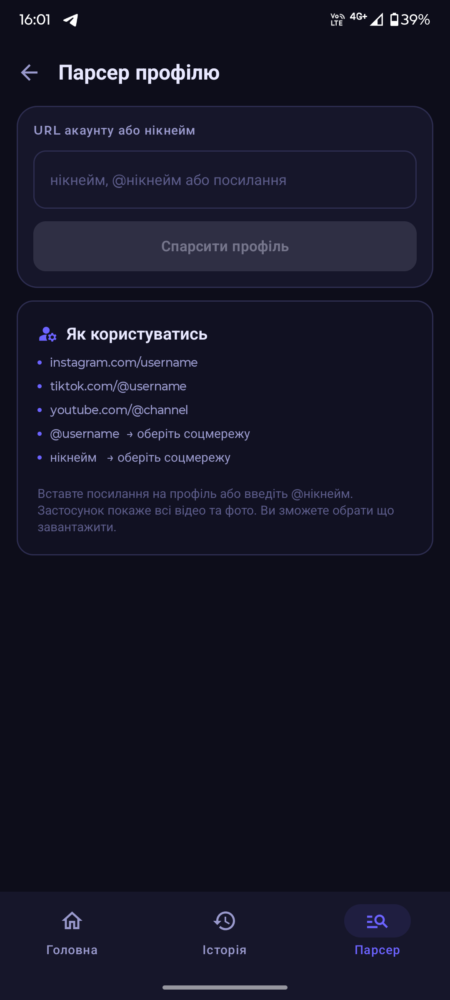
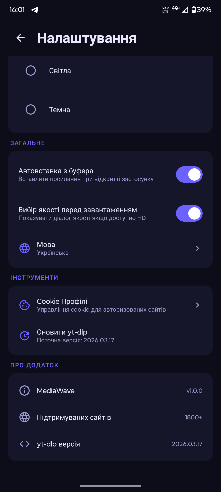

# MediaWave

<div align="center">

**Современный загрузчик медиа для Android**

Скачивай видео и аудио с YouTube, TikTok, Instagram и ещё 1800+ сайтов


</div>

---

## 📱 Скриншоты

<div align="center">

| Главная | История | Парсер профиля | Выбор платформы | Настройки |
|:-------:|:-------:|:--------------:|:---------------:|:---------:|
|  |  |  |  |  |

</div>

---

## ✨ Возможности

### 🔗 Загрузка по ссылке
Просто скопируй ссылку на видео или пост — приложение автоматически вставит её из буфера обмена при открытии. Поддерживается более **1800 сайтов**: YouTube, TikTok, Instagram, Twitter/X, Facebook, VKontakte, Reddit, Pinterest, Twitch, Rumble и многие другие. Движок загрузки — актуальная версия **yt-dlp** (обновляется прямо из приложения).

### 👤 Парсер профиля
Введи никнейм или URL аккаунта — приложение покажет все видео и фото этого профиля. Работает с Instagram, TikTok, YouTube, Twitter/X, Facebook, VKontakte, Reddit, Pinterest, Twitch, Rumble. Можно выбрать нужные файлы и скачать их одним нажатием.

### 📋 История загрузок
Все загрузки сохраняются в истории с отображением статуса. Можно отслеживать завершённые, активные и неудавшиеся загрузки.

### 🎬 Выбор качества
Перед загрузкой отображается диалог с доступными форматами и разрешениями (если источник поддерживает HD). Выбирай между качеством и размером файла.

### 🍪 Cookie-профили
Для загрузки с приватных или авторизованных аккаунтов можно добавить cookies из браузера. Поддерживается несколько профилей для разных сайтов.

### ⚡ Фоновые загрузки
Загрузки работают в фоне через Foreground Service — можно свернуть приложение, и закачка не прервётся. Уведомление показывает прогресс в реальном времени.

### 🌍 Мультиязычность
Интерфейс доступен на 8 языках: **Украинский, Русский, Английский, Немецкий, Испанский, Французский, Португальский, Китайский**.

### 🎨 Тема оформления
Поддерживается светлая и тёмная тема. Тёмная тема активирована по умолчанию.

---

## 📂 Куда сохраняются файлы

| Тип | Папка на устройстве |
|-----|---------------------|
| 🎬 Видео | `Movies/MediaWave` |
| 🎵 Аудио | `Music/MediaWave` |

---

## 🛠️ Технологии

| Компонент | Технология |
|-----------|-----------|
| Язык | Kotlin |
| UI | Jetpack Compose + Material 3 |
| Архитектура | MVVM + Repository |
| DI | Hilt |
| База данных | Room |
| Загрузчик | youtubedl-android (yt-dlp) |
| Фоновые задачи | WorkManager + Foreground Service |
| Настройки | DataStore Preferences |
| Сеть | OkHttp |
| Изображения | Coil |
| Анимации | Lottie |

---

## 📋 Требования

- Android **10+** (API 29)
- Интернет-соединение
- ~50 МБ для бинарника yt-dlp (скачивается автоматически при первом запуске)

---

## 🚀 Сборка

1. Клонируй репозиторий
2. Открой в **Android Studio Hedgehog** или новее
3. Синхронизируй Gradle
4. Запусти на устройстве или эмуляторе (API 29+)

```bash
git clone https://github.com/YOUR_USERNAME/MediaWave.git
cd MediaWave
./gradlew assembleDebug
```

---

## 📁 Структура проекта

```
app/src/main/java/com/mediawave/downloader/
├── MainActivity.kt                  — точка входа
├── MediaWaveApp.kt                  — Application класс (Hilt)
├── data/
│   ├── db/                          — Room: база данных и DAO
│   ├── model/                       — модели данных
│   └── repository/                  — репозитории, DataStore
├── di/                              — Hilt модули
├── download/
│   ├── DownloadManager.kt           — логика загрузки через yt-dlp
│   └── DownloadService.kt           — Foreground Service
├── ui/
│   ├── screens/
│   │   ├── home/                    — главный экран загрузки
│   │   ├── history/                 — история загрузок
│   │   ├── profile/                 — парсер профилей
│   │   ├── settings/                — настройки
│   │   └── cookies/                 — управление cookie
│   └── theme/                       — тема Compose
└── util/
    └── LocaleHelper.kt              — смена языка
```

---

## 📜 Лицензия

Проект предназначен для личного и образовательного использования.
yt-dlp и youtubedl-android распространяются по собственным лицензиям.
